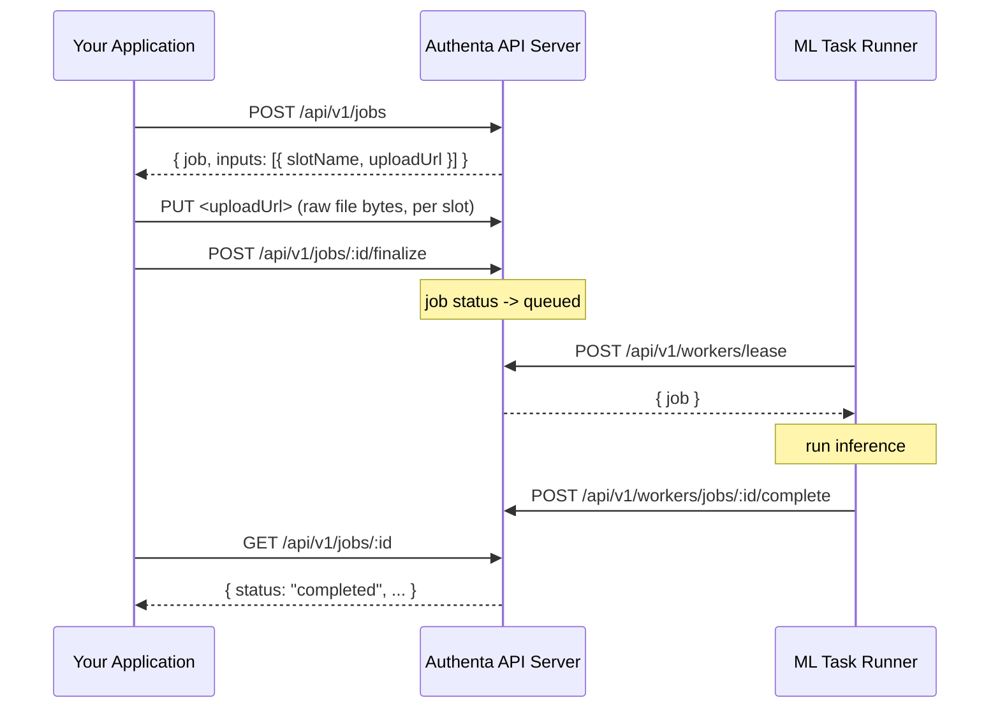

# Using Authenta

## Overview

This guide explains how to integrate your application with **Authenta On-Prem** through the Authenta API Server. All job creation, file upload, and result retrieval happens over REST — there is no RabbitMQ or message-queue integration in the current on-prem deployment; queueing happens internally in PostgreSQL, and the ML Task Runner communicates with the API server over HTTP.

> There is no bundled demo web application in the current deployment. All integration happens directly against the Authenta API Server's REST endpoints described below.

## Job Lifecycle

A job goes through five steps, all driven by your application against the API server (default `http://localhost:8080`, or `http://api-server:8080` from another container on the same Docker network):

1. **List task types** — discover which detection capabilities are available to your tenant
2. **Create the job** — declare the task type and input slots; the API returns one upload URL per slot
3. **Upload each input** — `PUT` the raw file bytes to its upload URL
4. **Finalize the job** — tells the API all inputs are uploaded; the job moves to `queued`
5. **Poll (or wait) for the result** — the ML Task Runner picks up the job, runs inference, and reports the result back to the API



## 1. Authenticate

Every call (except the upload `PUT` itself) requires an `Authorization: Bearer` header — either a short-lived JWT from `/api/v1/auth/login`, or a long-lived API key created via `/api/v1/auth/api-keys`. For server-to-server integrations, an API key is usually simpler:

```bash
curl -X POST http://localhost:8080/api/v1/auth/api-keys \
  -H "Authorization: Bearer <your-jwt>" \
  -H "Content-Type: application/json" \
  -d '{"name": "on-prem-integration"}'
```

## 2. List Available Task Types

```bash
curl http://localhost:8080/api/v1/task-types \
  -H "Authorization: Bearer <api-key-or-jwt>"
```

The task types available to your tenant correspond to the worker's configured `WORKER_CAPABILITIES` (see [Configuration](/on-prem/configuration)) — for a default deployment: `ai-audio-detection`, `ai-image-detection`, `ai-video-detection`, `audio-splitter`, `document-forgery-detection`, `document-intelligence`, `ekyc-deepfake`, `face-embedding`, `face-intelligence`, `face-liveness-detection`, `face-similarity`, `faceswap-detection`.

## 3. Create a Job

```bash
curl -X POST http://localhost:8080/api/v1/jobs \
  -H "Authorization: Bearer <api-key-or-jwt>" \
  -H "Content-Type: application/json" \
  -d '{
    "taskTypeId": "<task-type-id>",
    "inputs": [
      { "slotName": "primary", "fileName": "video.mp4", "contentType": "video/mp4", "sizeBytes": 4831201 }
    ]
  }'
```

Response:

```json
{
  "job": { "id": "101", "status": "initiated" },
  "inputs": [
    { "slotName": "primary", "uploadUrl": "http://localhost:8080/api/v1/uploads?path=...&expires=...&sig=...", "uploadUrlExpiresAt": "2026-07-17T12:10:00Z" }
  ]
}
```

`uploadUrl` is a pre-signed URL. On this on-prem deployment it points back at the API server itself (`PUT /api/v1/uploads`, a local-disk sink); the same client code also works unmodified against a cloud deployment where `uploadUrl` points at S3 instead — your integration doesn't need to know which.

## 4. Upload Each Input

```bash
curl -X PUT "<uploadUrl>" \
  -H "Content-Type: video/mp4" \
  --data-binary @video.mp4
```

Repeat for every slot returned in step 3. A successful upload returns `204 No Content`.

## 5. Finalize the Job

```bash
curl -X POST http://localhost:8080/api/v1/jobs/101/finalize \
  -H "Authorization: Bearer <api-key-or-jwt>"
```

This verifies every input slot was uploaded and transitions the job to `queued`. From here, the ML Task Runner leases it, runs the model, and reports the result — no further action needed from your application.

## 6. Retrieve the Result

Poll the job until it leaves `queued`/`processing`:

```bash
curl http://localhost:8080/api/v1/jobs/101 \
  -H "Authorization: Bearer <api-key-or-jwt>"
```

```json
{
  "id": "101",
  "status": "completed",
  "result": { "confidence": 0.9821, "classification": "deepfake" }
}
```

List output artifacts (e.g. heatmaps) once completed:

```bash
curl http://localhost:8080/api/v1/jobs/101/artifacts \
  -H "Authorization: Bearer <api-key-or-jwt>"
```

## Complete Node.js Example

```javascript
const API_URL = 'http://localhost:8080';
const API_KEY = process.env.AUTHENTA_API_KEY;

async function runDetection(taskTypeId, filePath, fileName, contentType) {
  const fs = await import('fs/promises');
  const fileBuffer = await fs.readFile(filePath);

  // 1. Create the job
  const createRes = await fetch(`${API_URL}/api/v1/jobs`, {
    method: 'POST',
    headers: { Authorization: `Bearer ${API_KEY}`, 'Content-Type': 'application/json' },
    body: JSON.stringify({
      taskTypeId,
      inputs: [{ slotName: 'primary', fileName, contentType, sizeBytes: fileBuffer.length }],
    }),
  });
  const { job, inputs } = await createRes.json();

  // 2. Upload the file
  await fetch(inputs[0].uploadUrl, {
    method: 'PUT',
    headers: { 'Content-Type': contentType },
    body: fileBuffer,
  });

  // 3. Finalize
  await fetch(`${API_URL}/api/v1/jobs/${job.id}/finalize`, {
    method: 'POST',
    headers: { Authorization: `Bearer ${API_KEY}` },
  });

  // 4. Poll for completion
  while (true) {
    const res = await fetch(`${API_URL}/api/v1/jobs/${job.id}`, {
      headers: { Authorization: `Bearer ${API_KEY}` },
    });
    const current = await res.json();
    if (current.status === 'completed' || current.status === 'failed') return current;
    await new Promise(r => setTimeout(r, 2000));
  }
}
```

## Best Practices

1. **Job Management**
   - Reuse a single API key per integration rather than minting one per request
   - Finalize promptly after upload — jobs left in `initiated` are cleaned up on a schedule
   - Poll with backoff (e.g. every 2–5 seconds) rather than tight-looping

2. **Resource Optimization**
   - Batch related jobs rather than firing large bursts synchronously
   - Watch worker throughput and scale `ml-task-runner-gpu` if jobs stay `queued` for long (see [scaling caveat](/on-prem/architecture#scalability))

3. **Error Handling**
   - Treat `status: "failed"` and its `errors[]` as terminal — the job has already been retried per the task type's `maxRetries`
   - Implement your own retry only at the job-creation level (create a new job), not by polling the same failed job

## Monitoring & Troubleshooting

- **Worker registration:** `docker compose logs -f ml-task-runner-gpu` — should show `Worker registered` shortly after startup
- **Job stuck in `queued`:** confirm the worker actually registered (`GET /api/v1/workers` with a platform-operator token) and that `WORKER_BOOTSTRAP_TOKEN` matches between `api-server` and `ml-task-runner-gpu` in `docker-compose.yml`
- **API server health:** `curl http://localhost:8080/api/v1/health/ready` — checks DB and storage connectivity

## Next Steps

- Review [maintenance procedures](/on-prem/maintenance-updates)
- Learn about [security best practices](/on-prem/security-compliance)
- Get [support](/on-prem/support)
